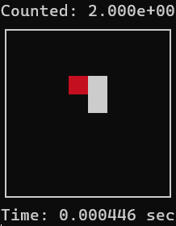

# Brookshear Machine: Langton's Ant

<p align="center">
  
</p>

This project implements the "Langton's Ant" cellular automaton on a simulated 8-bit architecture. It showcases emergent complexity where a simple set of rules leads to chaotic movement, all running within a 256-byte memory limit.

## What is Langton's Ant?
Langton's Ant is a two-dimensional Turing machine with a very simple logic set. The "ant" moves across a grid of black and white cells based on the following rules:

1. **At a white square:** Turn 90° clockwise, flip the color of the square to black, and move forward one unit.
2. **At a black square:** Turn 90° counter-clockwise, flip the color of the square to white, and move forward one unit.

## Custom ISA Extension: Opcode 0xF (Display)
The machine uses an extended **Opcode 0xF** to handle real-time rendering of the ant's world.

1. **Sprite Injection:** Unlike a static grid, the `_display` function checks registers **RD** (Row) and **RE** (Column Mask) to determine the ant's exact coordinates.
2. **Red Highlight:** The display driver injects ANSI color codes (`\033[31m`) to render the ant as a distinct red block <span style="color: red;">██</span> atop the standard grid.
3. **Frame Buffer:** The machine visualizes a 64-bit window (8x8) starting from memory address `0xF8`.

## Core Logic & Data Bits
The assembly code (`Ant_ML`) manages the ant's state using bitwise operations to fit the logic into a tiny memory footprint.

* **State Tracking:** Register **RC** stores the heading, while **RD** and **RE** track the spatial position. The column is managed as a **bitmask** (e.g., `0x80`, `0x40`) rather than a simple integer to allow for instant XOR flipping.
* **Color Flipping:** The instruction `900E` (XOR) is used to flip the bit at the ant's current location. This effectively toggles the square between black (0) and white (1) in a single cycle.
* **Directional Math:** The ant's heading is updated by adding constants for Clockwise (`0x40`) or Counter-clockwise (`0xC0`). These values are mapped to period 4 offsets starting at 0x01.
* **Topology & Clamping:** The code implements a wrapping world. When the ant moves off the 8x8 grid, the `8DD1` and `7DD0` instructions perform a bitwise AND/OR to wrap the address back to the frame buffer range (`0xF8` - `0xFF`).
* **Rotation (ROR):** To handle lateral movement, the machine uses the Rotate Right (`A`) instruction on the column mask, allowing the ant to "step" through bits in a byte.

## Usage
To run the simulation and observe the emergent behavior, execute the following command:

```bash
python -m Langtons_Ant.Ant_ML
```

---
<p align="center"><sub>Inspired by Glenn Brookshear's CS: An Overview (11th Ed).<br>Copyright © Thanas Fuqi 2026</sub></p>
