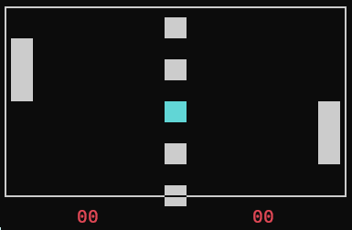

# Brookshear Machine: Pong

<p align="center">
  
</p>

This project implements the classic "Pong" arcade game on Brookshear. It showcases real-time user input, collision physics, and scoring logic constrained within a minimalist 256-byte memory environment.

## What is Pong?
Pong is a two-player sports game that simulates table tennis. Each player controls an on-screen paddle by moving it vertically. The goal is to reach 11 points by making the ball pass the opponent's paddle.

1. **Movement:** Players use 'W/S' (Left) and 'I/K' (Right) to intercept the ball.
2. **Physics:** The ball deflects off the top and bottom walls and reverses direction upon successful paddle contact.
3. **Scoring:** If the ball hits the left or right boundary without hitting a paddle, the opposing player earns a point and the ball resets.

## Custom ISA Extension: Opcode 0xF (Display & Sync)
The standard Brookshear instruction set is extended with **Opcode 0xF**, acting as a high-level GPU and sync driver.

1. **Frame Buffer:** The display reads from a memory range (starting at `0xF1`) to render the paddles and boundaries.
2. **Dynamic Rendering:** The `_display` function handles ANSI escape codes to provide a flicker-free experience, drawing the paddles, the ball (highlighted in cyan), and the scoreboard.
3. **Clock Sync:** This opcode includes a `time.sleep` calculation to ensure the 8-bit CPU runs at a consistent, playable speed regardless of the host machine's power.

## Core Logic & Data Bits
The game utilizes specific registers and memory addresses to manage state:

* **Asynchronous Input:** A background listener thread captures keystrokes and injects them directly into **Register 0xF**, which the CPU polls during its main loop.
* **Collision Detection:** The machine uses bitwise `OR` operations (`7RST`) between the paddle's bitmask and the ball's position. if `Paddle | Ball == Paddle`, a collision is confirmed.
* **Ball Vectoring:** The ball’s trajectory is controlled by `BALL_Y_DELTA` (using bit rotation for vertical movement) and `BALL_X_DELTA` (using addition/subtraction for horizontal lane changes).

## Usage
To play the game, ensure the core machine library is present and run the script:

```bash
python -m Pong_Game.Brookshear_Pong
```

---
<p align="center"><sub>Inspired by Glenn Brookshear's CS: An Overview (11th Ed).<br>Copyright © Thanas Fuqi 2026</sub></p>
