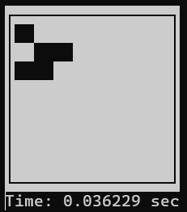
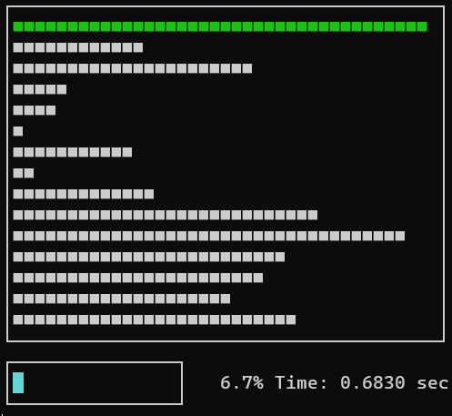
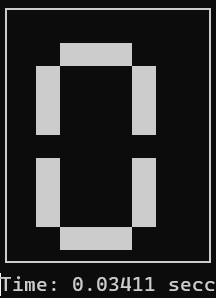
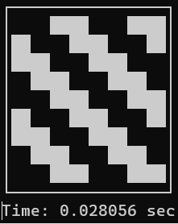

# Brookshear Machine Emulator
### Inspired by Glenn Brookshear's "Computer Science: An Overview" (11th Edition)

A Python implementation of the Brookshear virtual machine, simulating a 16-register CPU with 256 bytes of RAM.

**Also included:** A collection of programs that push the 256-byte limit, all written 
in raw hexadecimal.

**The Challenge:** No assembler. No debugger. No inequality operators. Just hex, 
bitwise logic, and manually calculated jump offsets. One wrong byte = hours of debugging.

## Featured Programs

| Project | Demo Preview | Highlights |
|---------|---------|------------|
| [🐍 **Snake (186 B)**](./Snake/) |  | Real-time input • Collision logic • RNG + validation • Win state |
| [🧬 **Conway's Life (188 B)**](./Conways_Game_Of_Life/) |  | Toroidal grid • Neighbor counting via bits • Double buffering |
| [📊 **Sorting Visualizer (66 B)**](./Sort/) |  | Bit-by-bit comparison • Progress bar • Terminal beeps |
| [🔢 **7-Segment Display (218 B)**](./7_Segment_Display/) |  | Rendering • Bit-testing • 0-F cycle |
| [🌊 **Wave Animation (28 B)**](./Wave_Animation/) |  | Rotating pattern • Self-modifying code |

---
## The Instruction Set Architecture (ISA)

| Opcode | Instruction | Description |
| :--- | :--- | :--- |
| **1** | LOAD | Load register $R$ with the bit pattern found in memory cell $XY$. |
| **2** | LOAD | Load register $R$ with the bit pattern $XY$. |
| **3** | STORE | Store the bit pattern in register $R$ into memory cell $XY$. |
| **4** | MOVE | Copy the bit pattern in register $X$ to register $Y$. |
| **5** | ADD | Add bit patterns in registers $X$ and $Y$ (2's complement), result in $R$. |
| **7** | OR | Bitwise OR of registers $X$ and $Y$, result in $R$. |
| **8** | AND | Bitwise AND of registers $X$ and $Y$, result in $R$. |
| **9** | XOR | Bitwise XOR of registers $X$ and $Y$, result in $R$. |
| **A** | ROTATE | Rotate the bit pattern in register $R$ to the right $Y$ times. |
| **B** | JUMP | Jump to instruction at address $XY$ if Reg $R$ equals Reg 0. |
| **C** | HALT | Terminate the program execution. |

**Note:** The code expects a hexadecimal value in the format [ **Opcode** | **R** ] [ **X** | **Y** ]. (i.e 1A2B)

---
## Usage Guide

Here's a minimal version to run a code in the Brookshear machine simulator.

```python
from Machine_language_CORE import Machine

cpu = Machine()
cpu.load(CODE_STRING)
cpu.run()
```

The **CODE_STRING** must be a non-empty Python string in one of the following formats.

```python
CODE_STRING = "ORXYORXYORXY ..."

CODE_STRING = """
ORXY
ORXY
ORXY ...
"""

CODE_STRING = """
ORXY ; Comment No.1
ORXY ; Comment No.2

ORXY ; Comment No.3 ...
"""
```

Additionally you can customize the way the machine is run by changing the following properties.

```python
# Disable the printing logs of the CPU decode
cpu.debug = False

"""Configure the printing window"""
# Printing the last i rows
cpu.ROWS = i
# Starting at column j
cpu.COLS = j
```

Also the user is able to change the ISA as needed.

```python
# You can ignore inputs given by either (_) or (*args)
def _NEW_ISA_OPERATION(o1, o2, o3, next_byte):
    """ YOUR ISA LOGIC HERE """

# The empty opcodes are 0xD, 0xE, 0xF
cpu.ISA[0xD] = _NEW_ISA_OPERATION
```

---
## Debug Tools

Two dump utilities are available for inspecting machine state after execution.
```python
# Dumps memory and registers to memory_dump.txt as hex grid
cpu.memory_dump()

# Dumps log_buffer to log_dump.txt (requires debug=True)
cpu.log_dump()
```

### memory_dump.txt layout
```
     0  1  2 ...  F  ← Registers (r0 -> rF)
    XX XX XX ... XX  ← register values hex

    0  1   2 ...  F  ← memory indices (0 -> F)
0   XX XX XX ... XX  ← 0x00 -> 0x0F
1   XX XX XX ... XX
...
F   XX XX XX ... XX  ← 0xF0 -> 0xFF
```

---

## What I Learned Building These

**Jump offset calculation is everything.** Adding a feature means inserting bytes, 
which shifts all subsequent addresses. Every jump that crosses the insertion point 
needs recalculating. Miss one? Infinite loop or crash.

**Build iteratively, not monolithically.** Snake started as simple movement (40 bytes), 
then grew: +collision, +food, +validation, +input blocking. Each addition was surgical. 
Writing 186 bytes at once would've been impossible to debug.

**Bit manipulation replaces entire algorithms.** No modulo? Use `AND 0x07`. 
No comparison operator? Scan bits MSB-first. Constraints force creativity.

**Self-modifying code is elegant under pressure.** When space is tight, storing 
computed addresses and loading from them beats any alternative.

---
<p align="center"><sub>Inspired by Glenn Brookshear's CS: An Overview (11th Ed).<br>Copyright © Thanas Fuqi 2026</sub></p>
