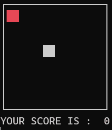

# Brookshear Machine: Snake Game

<p align="center">
  
</p>

This project implements the classic **Snake Game** on a simulated 8-bit architecture based on the Brookshear machine model. It demonstrates how real-time interaction, state management, and dynamic rendering can be achieved within a highly constrained 256-byte memory system and a minimalist instruction set.

## What is Snake?
Snake is a real-time game where the player controls a growing line (the "snake") on a grid. The objective is to collect food while avoiding collisions.

Core mechanics:

1. **Movement:** The snake moves continuously in one direction and can be steered using input.
2. **Growth:** When the snake eats food, it grows in length.
3. **Collision:** The game ends if the snake collides with itself.
4. **Win Condition:** The game is completed when the snake reaches its maximum size.

## Custom ISA Extensions

### Opcode 0xD (Random Generator)
A custom instruction mapped to **0xD** provides pseudo-random values:

- Generates a random byte.
- Clips the byte in the **range**
- Stores the byte in Register R

### Opcode 0xF (Display Driver)
A custom display instruction mapped to **0xF** enables terminal rendering:

1. **Memory Mapping:** A region of RAM (starting at `XY`) stores pixel positions.
2. **Grid Rendering:** Each byte encodes a coordinate `(row, column)` using high/low nibbles.
3. **Visualization:** The `_display` function renders:
   - Non 0xFF values as `██`
   - First index of block as a red <span style="color: red;">██</span>
   - Empty space as blank
4. **Score Output:** Displays current score or completion message.

## Core Logic & Data Representation

The program operates entirely within constrained memory and register space:

* **Coordinate Encoding:**  
  Each snake segment is stored as a single byte:
  - High nibble → row
  - Low nibble → column

* **Snake Body Storage:**  
  Stored sequentially in memory starting from `0xC0-0xFF` (C0 is the food).

* **Index Register (`0xC`):**  
  Tracks current snake length (also acts as score).

* **Delta Movement:**  
  Movement is applied as a byte offset:
  - Left:  `0x07`
  - Right: `0x01`
  - Up:    `0xF0`
  - Down:  `0x10`

* **Input Handling:**  
  Keyboard input is written asynchronously into register `0xF`.

---

### Execution Flow

The program is structured into three main logical sections:

#### 1. Input & Direction Update
- Reads keyboard input (`W`, `A`, `S`, `D`)
- Updates movement delta accordingly
- Preserves last direction if no valid input is given

#### 2. Movement & Collision Detection
- Computes new head position
- Checks against all existing body segments
- Triggers termination on self-collision

#### 3. Food Handling & Growth
- Compares head position with food location
- If matched:
  - Increments length (`INDEX`)
  - Generates new food position (avoiding overlap)
- If not:
  - Shifts body forward (removes tail)

---

### Buffer Behavior

Unlike double-buffered systems, this implementation uses:

- **In-place body shifting** for movement
- **Sequential overwrite** for updating segments
- **Single-pass updates** per frame

This minimizes memory usage while maintaining deterministic behavior.

---

## Rendering & Timing

- The display is refreshed using the custom `0xF` opcode.
- Frame timing is dynamically adjusted based on snake length:
  - Longer snake → faster updates
- Rendering is done directly in the terminal using ANSI escape codes.

---

## Usage

To run the program, execute from the root directory:

```bash
python -m Snake.Snake_ML
```

---
<p align="center"><sub>Inspired by Glenn Brookshear's CS: An Overview (11th Ed).<br>Copyright © Thanas Fuqi 2026</sub></p>
